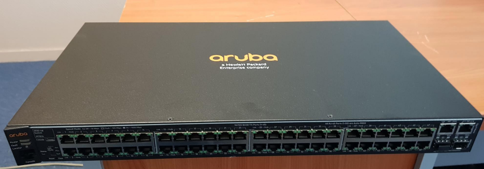
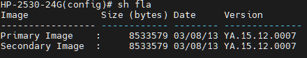
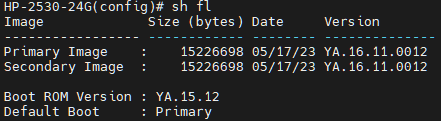
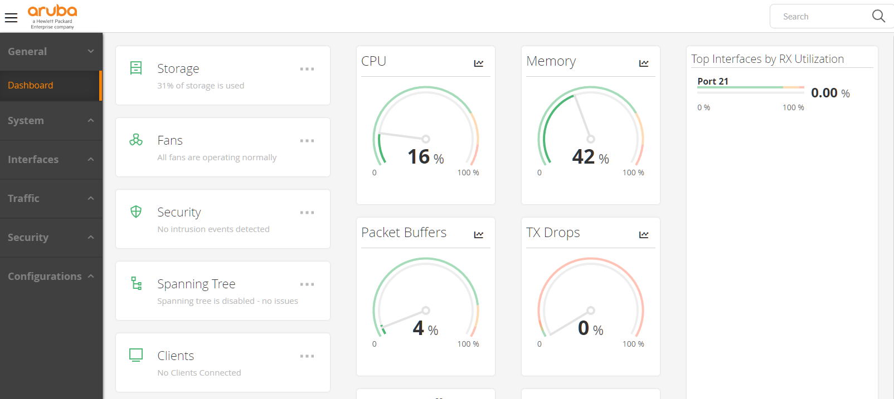

# Mise à jour du firmware des switches Aruba



## I. Présentation

La mise à jour du firmware des switches Aruba est une étape cruciale pour assurer le bon fonctionnement et la sécurité de votre réseau. Dans cet article, nous vous expliquerons en détail les étapes que j'ai suivie pour effectuer cette mise à jour, en veillant à ce que votre matériel soit à jour et conforme aux normes requises afin d'avoir le matériel nécessaire au remaniement de infrastructure réseau de puiseur centre de formation.

## II. Prérequis

Avant de commencer le processus de mise à jour du firmware, assurez-vous de disposer des éléments suivants :

- **Câble console** : Vous aurez besoin d'un câble console pour vous connecter au switch et effectuer les configurations nécessaires.
- **Firmware à jour** : Assurez-vous de télécharger la dernière version du firmware depuis le site officiel d'Aruba Networks. Vous pouvez trouver les mises à jour sur [https://asp.arubanetworks.com/downloads;search=ya;sort=VERSION_DESC;fileTypes=SOFTWARE;products=Aruba%20Switches](https://asp.arubanetworks.com/downloads;search=ya;sort=VERSION_DESC;fileTypes=SOFTWARE;products=Aruba Switches).
- **Serveur TFTP ou SFTP** : Créez un serveur TFTP ou SFTP en utilisant des logiciels tels que MobaXterm ou Tftpd. Ce serveur sera utilisé pour le transfert du fichier firmware vers le switch.

## III Réinitialisation de la configuration

Les switch devant étre réutiliser en production j'ai effectuer un réinitialisation de leur configuration afin de partir sur des basse saine, bien sur si la configuration était a conserver j'aurais effectuer une sauvegarde des la configuration existante :

1. Éteignez le switch, puis rallumez-le en maintenant le bouton "clear" enfoncé jusqu'à ce que la LED clignote. Cette étape permet de réinitialiser la configuration du switch aux paramètres par défaut.

## IV. Mise à jour du firmware

Pour effectuer la mise à jour du firmware, suivez les étapes suivantes :

1. Attribuez une adresse IP au switch en utilisant les commandes suivantes :
```
hp-2600(config)# vlan 1
hp-2800(vlan-5)# ip address 192.168.1.2 255.255.255.0
hp-2800(vlan-5)# exit
```


2. Vérifiez la connectivité entre votre poste de travail et le switch en effectuant un ping :
```
ping 192.168.1.2
```

3. Affichez la version du firmware actuellement installé sur le switch en utilisant la commande suivante :

   ```
   show flash
   ```

   


4. Déposer le fichier de la dernier version du firmware  sur votre serveur tftp

   /!\ Penser a désactiver votre par feu ou a autoriser le port 69 qui est utiliser par le serveur tftp /!\

5. Transférez le fichier firmware vers l'image secondaire du switch en utilisant la commande suivante :

```
copy tftp flash <ip-du-tftp> <nom-fichier-firmware>.swi secondary
```

6. Démarrez le switch en utilisant l'image secondaire que vous venez de télécharger :
```
boot system flash secondary
```


7. Vérifiez que le switch est opérationnel avec le nouveau firmware en utilisant la commande suivante :
```
show flash
```

8. Appliquez le firmware à l'image primaire du switch et redémarrez sur cette image en utilisant les commandes suivantes :
```
copy tftp flash <ip-du-tftp> <nom-fichier-firmware>.swi primary
boot system flash primary
```

9. Vérifiez à nouveau que l'image en cours d'utilisation est bien celle qui a été mise à jour en utilisant la commande suivante :
```
show flash
```



En suivant ces étapes, j'ai était en mesure de mettre à jour le firmware des switches Aruba de manière efficace.

Pour activer la mire web et constater que notre magnifique nouvelle a étai mise a jour.

```bash
configure terminal
web-management
```



Pour finalement ne pas l'utiliser vu que la CNIL recommande de désactiver la mire web pour des raison de sécurité, l'administration des switch se fera donc uniquement via le protocole ssh.

```
no web-management
```

