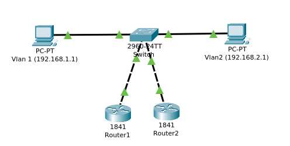
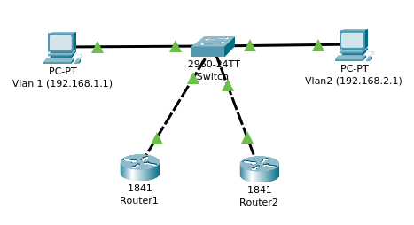

[TOC]

⏩ Tu n'a pas le temps ? Fait un copier-coller du texte ci-dessous :smile:

**Routeur 1**

```bash
en
conf t
int fa0/0.10
ip ad 192.168.1.252 255.255.255.0
st 10 ip 192.168.1.254
st 10 pri 110
sta 10 pre
int fa0/0.20
ip ad 192.168.2.252 255.255.255.0
st 20 ip 192.168.2.254
st 20 pri 110
sta 20 pre
end
wr
```

**Routeur 2**

```bash
en
conf t
int fa0/0.10
ip ad 192.168.1.253 255.255.255.0
st 10 ip 192.168.1.254
st 10 pri 90
sta 10 pre
int fa0/0.20
ip ad 192.168.2.253 255.255.255.0
st 20 ip 192.168.2.254
st 20 pri 90
sta 20 pre
end
wr
```


---

# I Présentation

Un cluster est un groupe de router vu comme un seul routeur virtuel. Le principal avantage d'un cluster de router est que lorsqu'un router tombe en panne un autre va alors le remplacer. Cependant si le router avec la plus grande priorité revient à fonctionner, il restera en attente et ne récupèrera pas le routage.

ℹ️ Si 2 router ont le même niveau de priorité, c'est celui avec l'adresse IP la plus haute qui aura la priorité


# II Installation

Cette installation de cluster HSRP est basé sur une architecture qui effectue déjà du routage interVLAN, détaille ici --> [RoutageInterVlan](https://cossu.tech/routageintervlan)

Pour créer un cluster de routeur, il va me falloir 3 adresses IP disponibles **par VLAN** une pour chaque router plus une pour le cluster.



| Vlan | Router 1      | Router 2      | Cluster       |
| ---- | ------------- | ------------- | ------------- |
| 10   | 192.168.1.252 | 192.168.1.253 | 192.168.1.254 |
| 20   | 192.168.2.252 | 192.168.2.253 | 192.168.2.254 |

Pour le routeur 1, je lui associe l'IP 192.168.1.255 sur l'interface virtuelle fa0/0.10 en lui indiquent l'adresse IP du cluster à savoir 192.168.1.254 et la priorité qu'il aura dans le cluster (110).

Puis je fais de même pour l'interface fa0/0.20 qui est l'interface du vlan 20 en changement l'adresse IP par 192.168.2.252.

**Router 1**

```bash
en
conf t
int fa0/0.10
ip ad 192.168.1.252 255.255.255.0
st 10 ip 192.168.1.254
st 10 pri 110
sta 10 pre

int fa0/0.20
ip ad 192.168.2.252 255.255.255.0
st 20 ip 192.168.2.254
st 20 pri 110
sta 20 pre
end
wr
```


**Router 2**

La configuration du router 2 diffèrent du router 1 car il a une adresse IP différente et une priorité différente.

```bash
en
conf t
int fa0/0.10
ip ad 192.168.1.253 255.255.255.0
st 10 ip 192.168.1.254
st 10 pri 90
sta 10 pre

int fa0/0.20
ip ad 192.168.2.253 255.255.255.0
st 20 ip 192.168.2.254
st 20 pri 90
sta 20 pre
end
wr
```


# III Test de fonctionnement

Pour vérifier le bon fonctionnement de la configuration des 2 routeurs je commence par éteindre les 2 routeurs pour cela, il faut cliquer sur le bouton d'alimentation (comme en vrai). 


Depuis un pc du vlan 10, je lance un ping infini sur un pc du vlan 20.


Je rallume le routeur 1, s'il est bien configuré les 2 machines devraient communiquer ! Après quelques minutes 2 machines arrivent bien à communiquer.


Maintenant j'éteins le Router 1 qui a une configuration fonctionnelle, il est temps de tester le Router 2 en répétant l'opération.


Les 2 pc arrivent à communiquer ! La configuration des 2 routeurs est bonne.

Maintenant je vais vérifier que le routeur 1 prend bien le relais en cas de dysfonctionnement du routeur 2. Donc j'arrête le router 2.


Normalement le routeur 1 devrait prendre le relais après quelques minutes.


On voit bien si dessus que quelques paquets on étaient perdu et que par la suite le routage est revenu a la normal.

Le cluster HSRP est donc fonctionnel.


