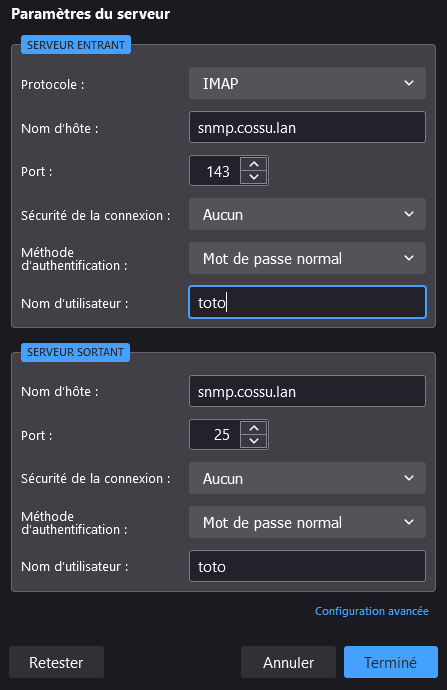
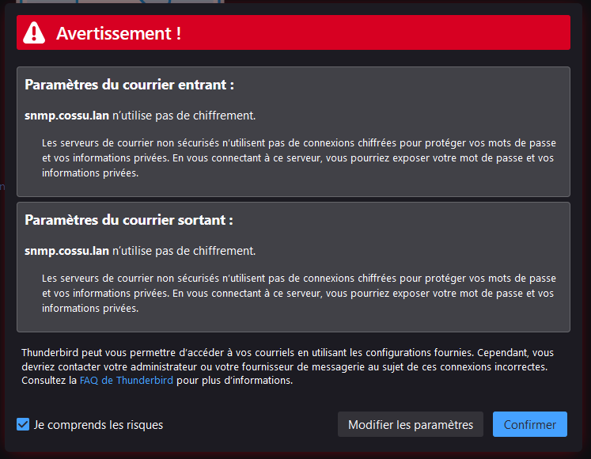

[TOC]

# Mise en place d'un serveur de messagerie électronique.

Un **serveur de messagerie électronique** est un [logiciel](https://fr.wikipedia.org/wiki/Logiciel) [serveur](https://fr.wikipedia.org/wiki/Serveur_informatique) de [courrier électronique](https://fr.wikipedia.org/wiki/Courrier_électronique). Il a pour vocation de transférer les messages électroniques d'un  serveur à un autre. Un utilisateur n'est jamais en contact direct avec  ce serveur mais utilise soit un [client de messagerie](https://fr.wikipedia.org/wiki/Client_de_messagerie) installé sur son terminal (ordinateur ou smartphone), soit une [messagerie web](https://fr.wikipedia.org/wiki/Messagerie_web), qui se charge de contacter le serveur pour envoyer ou recevoir les  messages. On parle dans le premier cas de client lourd, dans le deuxième cas de client léger.


## DNS

Pour le fonctionnement de tout cette infrastructure  il va falloir dans un premier temp disposé d'un serveur DNS ! 
Je vous donc procéder à la création d'un zone DNS local avec l'outils [Bind9](https://cossu.tech/bind9) assister par [Ansible](https://cossu.tech/ansible) histoire de pouvoir prendre un ☕ le temp que la zone Dns s'installe.

Dans un premier temp je téléchargement mes rôles ansible qui sont stocker sur GitHub.

```bash
git clone https://github.com/leghort/role-ansible.git
```

J'ouvre le répertoire avec Visual Studio Code pour avoir une vue des fichiers et un terminal à disposition dans la même fenêtre.


J'édite le fichier hosts pour y ajouter la machine que je veux impacter a savoir `Lab-01` et je l'ajouter au Groupe `[bind9]`


Puis je modifie le fichier `/bind9/vars/main.yml` qui contient les variables du rôle ansible bind9 c'est le plus important, car c'est sur c'es variable que ansible va utiliser pour générer les fichiers de configuration ⚠️

> dnsName = Nom de domaine local qui va être configurer
> forwardDns = Le serveur DNS qui va récupérer les requeté que notre DNS ne gère pas par default c'est le DNS de Google 8.8.8.8


Maintenant j'exécuté le rôle ansible et je part prendre un ☕. 
```bash
ansible-playbook bind9.yml -i hosts
```

Alors ansible dit qu'il à fait 10 changement est que tout est OK donc pas d'erreur pour lui.


Bon je vais faire une vérification a la main que le DNS est bon, donc connexion en ssh sur le serveur 

```bash
ssh toor@192.168.1.100
```

vu que je veut savoir quel serveur réponse au requête dns de `dns.cossu.lan`

```bash
nslookup dns.cossu.lan
```

>Server:         192.168.1.100
>Address:        <span style="color:green">192.168.1.100#53</span>
>
>Name:   <span style="color:green">dns.cossu.lan</span>
>Address: <span style="color:green">192.168.1.100</span>

Ok le nom `dns.cossu.lan = 192.168.1.100` et c'est le server `192.168.1.100` qui nous répond !

Maintenant au tour d'un nom qui n'est pas dans notre zone local pour tester le forwarddns.

```bash
nslookup irp.nain-t.net
```

>Server:         192.168.1.100
>Address:        <span style="color:green">192.168.1.100#53</span>
>
>Non-authoritative answer:
><span style="color:green">irp.nain-t.net</span>  canonical name = vps.nain-t.net.
>Name:   vps.nain-t.net
>Address: <span style="color:green">51.68.121.59</span>
>Name:   vps.nain-t.net
>Address: 2001:41d0:305:2100::2cd5

Alors  le server `192.168.1.100` dit que `irp.nain-t.net = 51.68.121.59` la résolution de nom ce fait bien donc le DNS avec BIND est fonctionnel.


## SMTP (MTA)

Maintenant que le serveur DNS est configurer, il est temp de crée le serveur SMTP sont travail va être de transmettre les mail c'est un ([MTA](https://fr.wikipedia.org/wiki/Mail_Transfer_Agent)) par exemple Postfix.

Je commande par installer les paquets tree, mailutils et postfix

```bash
sudo apt update -y && sudo apt upgrade -y && sudo apt-get install tree mailutils postfix -y
```

Postfix demande comment le configurer; je choisie Site Internet.


Il demande ensuite le nom de domaine.


Maintenant je vais configurer le MODE du serveur SMTP il en existe 2 :

[Mbox](https://fr.wikipedia.org/wiki/Mbox) : Chaque utilisateur à un gros fichier dans `/var/mail` qui contient tout ces mails.
[MailDir](https://fr.wikipedia.org/wiki/Maildir) : Chaque utilisateur à dans sont répertoire `/home` une arborescence  et chaque mail est contenu dans un fichier distinct.


 Le mode [Mbox](https://fr.wikipedia.org/wiki/Mbox) est celui utiliser pas default, préférant le mode [MailDir](https://fr.wikipedia.org/wiki/Maildir). Pour utiliser ce mode de fonctionnement j'ajoute la ligne `home_mailbox = Maildir/` dans le fichier de configuration `/etc/postfix/main.cf`

```bash
sudo bash -c 'echo "home_mailbox = Maildir/" >> /etc/postfix/main.cf'
```

Maintenant c'est l'heure des teste donc je crée un nouvelle utilisateur, par exemple toto.

```bash
sudo adduser toto
```

je lui envoie un message à l'aide d'un Client Mail ([MUA](https://fr.wikipedia.org/wiki/Client_de_messagerie))

```
mail toto
```

>Cc:
><span style="color:green">Subject: Wow un mail</span>
>Coucou Toto
>Si tu voie ce mail c'est que le server SMTP est opérationnel

Pour finir l'écriture du mail **CTRL + D** et je me connecter en tant que toto.

```bash
su - toto
```

Puis je liste tout les dossiers est fichier présent dans le `/home` de toto avec la commande `tree`


Tien il y a un fichier dans `Maildir/new`  soyons curieux et regardons sont contenue.

```bash
cat Maildir/new/1648241583.V801I255cM57140.cossu.lan
```

>Return-Path: <root@cossu.lan>
>X-Original-To: toto@cossu.lan
>Delivered-To: toto@cossu.lan
>Received: by cossu.lan (Postfix, from userid 0)
>  id 0B23F5F31C; Fri, 25 Mar 2022 21:53:03 +0100 (CET)
>To: <toto@cossu.lan>
><span style="color:green">Subject: Wow un mail</span>
>X-Mailer: mail (GNU Mailutils 3.10)
>Message-Id: <20220325205303.0B23F5F31C@cossu.lan>
>Date: Fri, 25 Mar 2022 21:53:03 +0100 (CET)
>From: root <root@cossu.lan>
>
>Coucou Toto
>Si tu voie se mail c'est que le server SMTP est opérationnel

Le MTA à savoir le serveur [Postfix](https://fr.wikipedia.org/wiki/Postfix) qui utilisent le protocole [SNMP](https://fr.wikipedia.org/wiki/Simple_Network_Management_Protocol) fonctionne  😃

Il ne reste à modifier le zone DNS pour y ajouter la gestion des requêtes MX et l'ip du serveur snmp.

```bash
sudo nano /etc/bind/db.cossu.lan
```

> @       IN NS dns.cossu.lan.
> <span style="color:green">           IN MX 10 snmp.cossu.lan.</span>
> dns     IN A 192.168.1.100
>    <span style="color:green">snmp  IN A 192.168.1.100</span>

Redémarrage du service bind9 pour appliquer les modifications.

```bash
sudo systemctl restart bind9
```

Vérification en envoyer une requête MX au serveur DNS

```bash
nslookup -type=mx cossu.lan
```

>Server:         192.168.1.100
><span style="color:green">Address:        192.168.1.100#53</span>
>
><span style="color:green">cossu.lan       mail exchanger = 10 snmp.cossu.lan.</span>

C'est fini pour la Partie [MTA](https://fr.wikipedia.org/wiki/Mail_Transfer_Agent) 🤗

## IMAP (MDA)

Pour le moment c'est sympa on peut envoyer des mail les consulter avec le terminal mais avec un [MUA](https://fr.wikipedia.org/wiki/Client_de_messagerie) comment [Thunderbird](https://www.thunderbird.net/fr/) c'est tout de même plus agréable.

Donc pour faire ça il faut faire un choix entre  [POP3](https://fr.wikipedia.org/wiki/Post_Office_Protocol)  ou [IMAP](https://fr.wikipedia.org/wiki/Internet_Message_Access_Protocol) :


IMAP me parais mieux, par contre il faut avoir activer le mode [MAILdir](https://fr.wikipedia.org/wiki/Maildir) ça tombe bien c'est déja le cas 😏

```bash
sudo apt install courier-imap
```

Redémarre les services postfix, courier-imap et courier-authdaemon

```bash
sudo /etc/init.d/postfix restart && sudo /etc/init.d/courier-imap restart && sudo /etc/init.d/courier-authdaemon restart
```

Maintenait sur un ordinateur qui à pour DNS principale 192.168.1.100 je vais configurer le client Thunderbird.


Dans mon cas le serveur IMAP et SNMP sont le même donc je peut utiliser le même nom DNS.






Ha ca sent plutôt bon il arrivent bien à ce connecter au serveur


Les mail que toto à reçu s'affiche bien dans Thunderbird !


Pour être sur je renvoie un mail à toto depuis un autre compte UNIX

```bash
mail toto
```

>Cc:
>Subject: Mail a voir sur thunderbird
>Ho tu consulte ce mail avec thunderbird ?


Les mail de toto arrivent bien dans Thunderbird, et toto peut aussi envoyer des mail 🤯


