[TOC]

# Mise en place d'un serveur de messagerie électronique.

Un **serveur de messagerie électronique** est un [logiciel](https://fr.wikipedia.org/wiki/Logiciel) [serveur](https://fr.wikipedia.org/wiki/Serveur_informatique) de [courrier électronique](https://fr.wikipedia.org/wiki/Courrier_électronique). Il a pour vocation de transférer les messages électroniques d'un  serveur à un autre. Un utilisateur n'est jamais en contact direct avec ce serveur, mais utilise soit un [client de messagerie](https://fr.wikipedia.org/wiki/Client_de_messagerie) installé sur son ordinateur ou smartphone, soit une [messagerie web](https://fr.wikipedia.org/wiki/Messagerie_web) (Webmail), qui se charge de contacter le serveur pour envoyer ou recevoir les  messages. On parle dans le premier cas de client lourd, dans le deuxième cas de client léger.

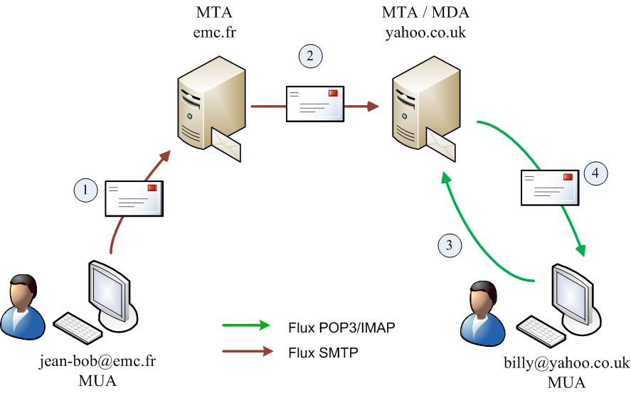

## DNS

Pour le fonctionnement de toute cette infrastructure, il va falloir dans un premier temps disposer d'un serveur DNS ! 
Je vous donc procéder à la création d'une zone DNS locale avec l'outil [Bind9](https://cossu.tech/bind9) assister par [Ansible](https://cossu.tech/ansible) histoire de pouvoir prendre un ☕ le temps que la zone DNS s'installe.

Dans un premier temps je téléchargement mes rôles Ansible qui sont stockés sur GitHub.

```bash
git clone https://github.com/leghort/role-ansible.git
```

J'ouvre le répertoire avec Visual Studio Code pour avoir une vue des fichiers et un terminal à disposition dans la même fenêtre.

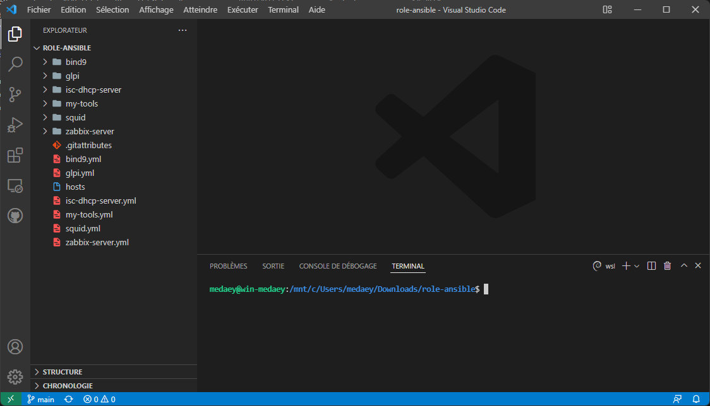

Puis j'édite le fichier hosts pour y ajouter la machine que je veux impacter à savoir `Lab-01` et enfin je la rajoute au groupe `[bind9]`
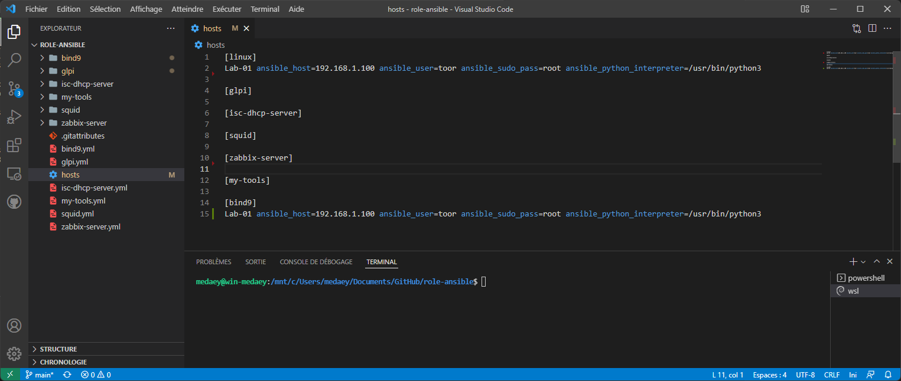

Au tour du fichier `/bind9/vars/main.yml` qui contient les variables du rôle Ansible bind9, c'est le plus important, car Ansible va utiliser ces variables pour générer les fichiers de configuration ⚠️

> dnsName = Nom de domaine local qui va être configuré
> forwardDns = Le serveur DNS qui va récupérer les requêtes que notre DNS ne gère pas, par défaut c'est le DNS de Google 8.8.8.8

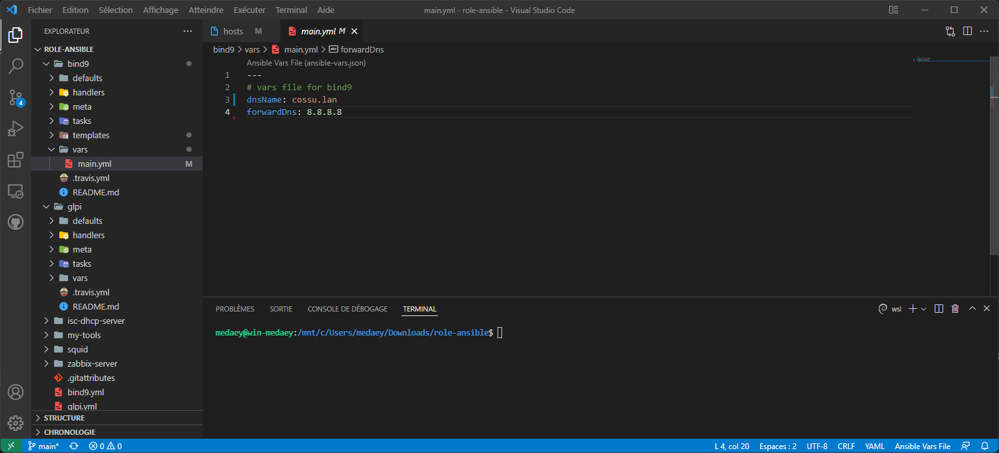

Maintenant j'exécuté le rôle Ansible et je pars prendre un ☕. 
```bash
ansible-playbook bind9.yml -i hosts
```

Alors Ansible dit qu'il a fait 10 changements est que tout est OK pour lui.

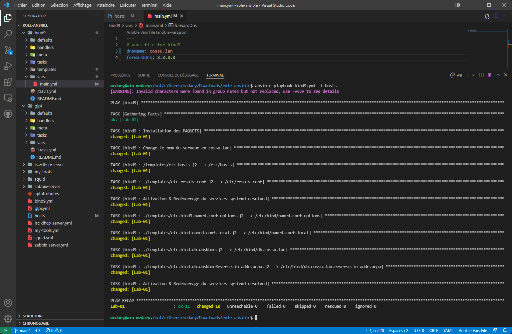

Bon je vais faire tout de même faire une vérification. Donc connexion en ssh sur le serveur.

```bash
ssh toor@192.168.1.100
```

et je veux savoir quel serveur répond aux requêtes dns de`dns.cossu.lan`

```bash
nslookup dns.cossu.lan
```

>Server:         192.168.1.100
>Address:        <span style="color:green">192.168.1.100#53</span>
>
>Name:   <span style="color:green">dns.cossu.lan</span>
>Address: <span style="color:green">192.168.1.100</span>

OK c'est bien notre serveur DNS `192.168.1.100` qui nous répond !

Maintenant au tour d'un nom qui n'est pas dans notre zone locale pour tester le forwarddns.

```bash
nslookup irp.nain-t.net
```

>Server:         192.168.1.100
>Address:        <span style="color:green">192.168.1.100#53</span>
>
>Non-authoritative answer:
><span style="color:green">irp.nain-t.net</span>  canonical name = vps.nain-t.net.
>Name:   vps.nain-t.net
>Address: <span style="color:green">51.68.121.59</span>
>Name:   vps.nain-t.net
>Address: 2001:41d0:305:2100::2cd5

Alors  le serveur `192.168.1.100` dit que `irp.nain-t.net = 51.68.121.59` la résolution de nom se fait donc bien pour le nom de domaine externe. BIND est fonctionnel !


## SMTP (MTA)

Maintenant que le serveur DNS est configuré, il est temps de créer le serveur SMTP son travail va être de transmettre les mails c'est un ([MTA](https://fr.wikipedia.org/wiki/Mail_Transfer_Agent)) par exemple Postfix.

Je commande par installer les paquets tree, mailutils, et postfix

```bash
sudo apt update -y && sudo apt upgrade -y && sudo apt-get install tree mailutils postfix -y
```

Postfix demande comment il doit être configuré "Site Internet".

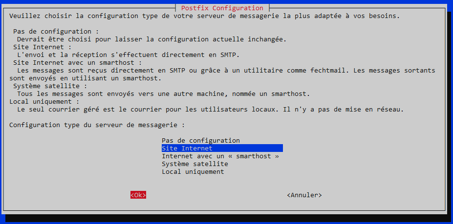

Il demande ensuite le nom de domaine qu'il va gérer.

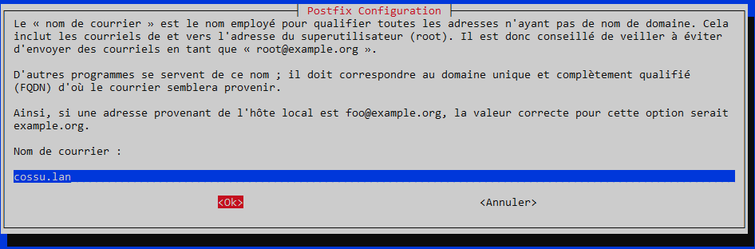

Maintenant je vais configurer le MODE du serveur SMTP il en existe 2 :

[Mbox](https://fr.wikipedia.org/wiki/Mbox) : Chaque utilisateur à un gros fichier dans `/var/mail` qui contient tous ces mails.
[MailDir](https://fr.wikipedia.org/wiki/Maildir) : Chaque utilisateur a dans son répertoire `/home` une arborescence 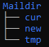 et chaque mail est contenu dans un fichier distinct.

ℹ️ Le mode [Mbox](https://fr.wikipedia.org/wiki/Mbox) est celui utilisé pas défaut.
Je préfère le mode [MailDir](https://fr.wikipedia.org/wiki/Maildir), pour l'utiliser il faut ajouter la ligne `home_mailbox = Maildir/` dans le fichier de configuration `/etc/postfix/main.cf`

```bash
sudo bash -c 'echo "home_mailbox = Maildir/" >> /etc/postfix/main.cf'
```

Maintenant c'est l'heure des tests, donc je crée un utilisateur, par exemple toto.

```bash
sudo adduser toto
```

je lui envoie un message à l'aide d'un client Mail ([MUA](https://fr.wikipedia.org/wiki/Client_de_messagerie))

```
mail toto
```

>Cc:
><span style="color:green">Subject: Wow un mail</span>
>Coucou Toto
>Si tu vois ce mail, c'est que le serveur SMTP est opérationnel

Pour finir l'écriture du mail **CTRL + D** et je me connecte en tant que toto.

```bash
su - toto
```

Puis je liste tous les dossiers & fichier présent dans le `/home` de toto avec la commande `tree`

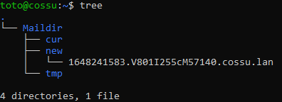

Tien il y a un fichier dans `Maildir/new`  soyons curieux et regardons sont contenues.

```bash
cat Maildir/new/1648241583.V801I255cM57140.cossu.lan
```

>Return-Path: <root@cossu.lan>
>X-Original-To: toto@cossu.lan
>Delivered-To: toto@cossu.lan
>Received: by cossu.lan (Postfix, from userid 0)
>  id 0B23F5F31C; Fri, 25 Mar 2022 21:53:03 +0100 (CET)
>To: <toto@cossu.lan>
><span style="color:green">Subject: Wow un mail</span>
>X-Mailer: mail (GNU Mailutils 3.10)
>Message-Id: <20220325205303.0B23F5F31C@cossu.lan>
>Date: Fri, 25 Mar 2022 21:53:03 +0100 (CET)
>From: root <root@cossu.lan>
>
>Coucou Toto
>Si tu vois ce mail, c'est que le serveur SMTP est opérationnel

Le MTA à savoir le serveur [Postfix](https://fr.wikipedia.org/wiki/Postfix) qui utilise le protocole [SMTP](https://fr.wikipedia.org/wiki/Simple_Mail_Transfer_Protocol) fonctionne  😃

Il reste à modifier la zone DNS pour y ajouter les requêtes MX et l'ip du serveur smtp.

```bash
sudo nano /etc/bind/db.cossu.lan
```

> @       IN NS dns.cossu.lan.
> <span style="color:green">           IN MX 10 smtp.cossu.lan.</span>
> dns     IN A 192.168.1.100
>    <span style="color:green">smtp IN A 192.168.1.100</span>

Redémarrage du service bind9 pour appliquer les modifications.

```bash
sudo systemctl restart bind9
```

Comme toujours il faut vérifier donc j'envoyer une requête MX au serveur DNS.

```bash
nslookup -type=mx cossu.lan
```

>Server:         192.168.1.100
><span style="color:green">Address:        192.168.1.100#53</span>
>
><span style="color:green">cossu.lan       mail exchanger = 10 smtp.cossu.lan.</span>

C'est fini pour la partie [MTA](https://fr.wikipedia.org/wiki/Mail_Transfer_Agent) 🤗

## IMAP (MDA)

Pour le moment on peut envoyer / lire des mails avec le terminal, mais avec un [MUA](https://fr.wikipedia.org/wiki/Client_de_messagerie) comment [Thunderbird](https://www.thunderbird.net/fr/) c'est tout de même plus agréable non ?

Donc pour faire ça il faut faire un choix entre  [POP3](https://fr.wikipedia.org/wiki/Post_Office_Protocol) ou [IMAP](https://fr.wikipedia.org/wiki/Internet_Message_Access_Protocol) :
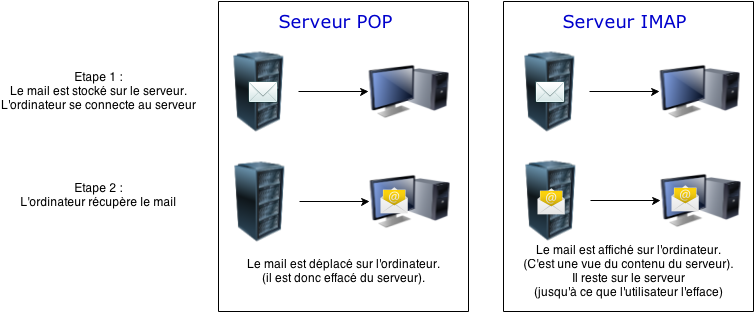

IMAP me semble le plus adapter, par contre il faut activé le mode [MAILdir](https://fr.wikipedia.org/wiki/Maildir) ça tombe bien c'est déjà le cas 😏

Donc ces parties installation de courriel-imap

```bash
sudo apt install courier-imap -y
```

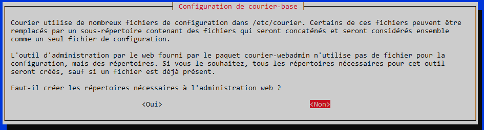

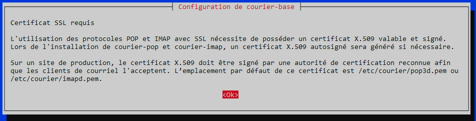

Redémarre les services postfix, courier-imap et courier-authdaemon

```bash
sudo /etc/init.d/postfix restart && sudo /etc/init.d/courier-imap restart && sudo /etc/init.d/courier-authdaemon restart
```

⚠️ Sur un ordinateur **qui a pour DNS principal 192.168.1.100** je configure le client Thunderbird.


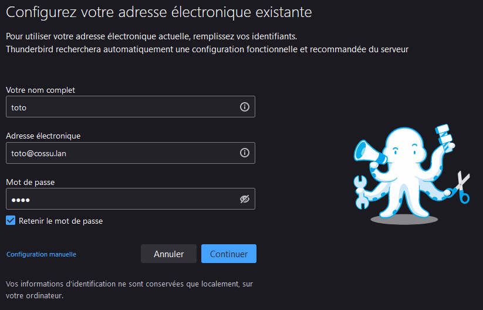

Dans mon cas le serveur IMAP est aussi le serveur SMTP, donc je peux utiliser le même nom DNS.

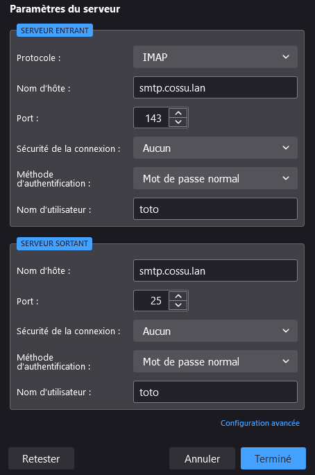

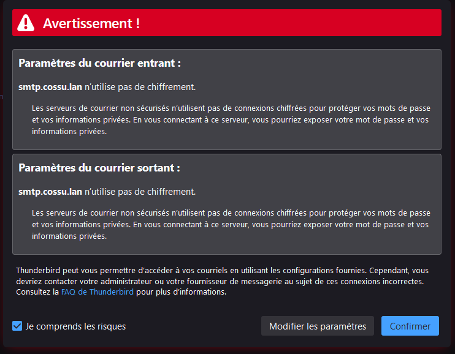


Ha ils arrivent bien à se connecter au serveur

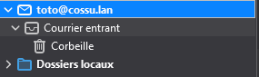

Les mails que toto à reçu s'affiche bien dans Thunderbird !

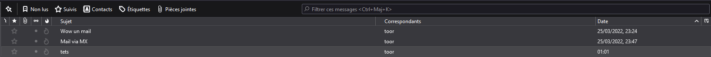

Pour être sûr, je renvoie un mail à toto depuis un autre compte UNIX

```bash
mail toto
```

>Cc:
>Subject: Mail a voir sur thunderbird
>Ho tu consultes ce mail avec thunderbird ?

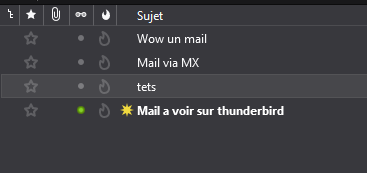

Le mail arrive bien dans Thunderbird, toto peut lire c'est mail 🤯


