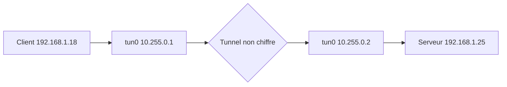

[TOC]

# Presentaion

Openvpn est un logiciel open source qui perme de mettre en place un Tunnel Privée Virtuel entre 2 machines, cette outil est trés pratique pour permettre un acces au réseau depuit l'exterieur, par exemple pour effetuer du télétravail avoir accès au réseau de l'entreprise a partir de chez soi.

### Prérequis

Dans un premier temp on install openvpn puis easy-rsa pour gérer les certificats.

```bash
sudo apt install openvpn easy-rsa -y
```

## Tunnel non  chiffré

Dans ce premier exemple je vais mettre en place un tunnel vpn trés basique sans chiffrement, le but étant de tester l'outils et d'analyser les trames qui transite sur l'interface tun0 avec whireshark. (l'interface tun0 est la carte réseau utiliser par openVPN pour faire le tunnel.)



### Serveur

Sur le serveur il vous faudra initialiser le tunel avec cette commande

```bash
sudo openvpn --dev tun0 --verb 5 --ifconfig 10.255.0.1 10.255.0.2
```

ℹ️ C'est une commande qui est s'execute en permanance, il ne faut pas la couper au risque de couper aussi le lien VPN !

### Client

La client quant a lui a besoin de l'option `--remote` suivie de l'adress ip du serveur a savoir dans notre exemple `192.168.1.25`.

```bash
sudo openvpn --dev tun0 --verb 5 --ifconfig 10.255.0.2 10.255.0.1 --remote 192.168.1.25
```

Quand le message `Initialization Sequence Completed` apparait c'est bon la connexion entre le 2 machines est effectuer, l'on peut allord vérifier celle si avec un ping du **client** vers le serveur.

```
ping -p70696E67 10.255.0.1
```

ℹ️ ce ping est un peut spécial le `-p70696E67` est du texte au format hexadecimal qui va étre ajouter au ping.

Dans le terminal de connexion ou la commande open a était executer une suite de `RWr` aparait cela signifie que la connexion s'effectuer bien dans les 2 sens.

```
RWrRWrRWrRWrRWrRWrRWrRWrRWrWRwrWRw
```

Pour voir plus en detail les trames qui sont envoyer avec la commande ping rien de mieu q'une analyse wireshark.


Avec cette image extrai de wireshark l'on constate que :

1) La machine 10.255.0.1 effectue un `ping request` vers 10.255.0.2 
3) La machine 10.255.0.2 éffectue un `ping reply` vers 10.255.0.1
ℹ️ Il y a bien evidament d'autre informations a retirer comme le port, le protocole, etc...

## Tunnel avec chiffrement symétrique

Maitenant je vais crée un tunnel avec une clef pour chiffrer la connexion, ce type de chiffrement est loing d'etre parafait mais il va permettre de constater avec une analyse de tram si les trame du vpn sont bien chiffrer.

⚠️ Veiller bien a arréte la commande du tunnel non chiffré vu précédament avec un CTRL+C

### Serveur

 Sur le serveur je génére la clef de chiffrement qui va étre utlisée par les 2 machines et  je donne accés en lecture à tout le monde sur le fichier clef pour pouvoir le transferer facilement via SCP. (un transfer avec FileZilla est également possible)

```bash
sudo openvpn --genkey secret /tmp/ClefSymetriqueSecrete && chmod o+r /tmp/ClefSymetriqueSecrete
```
⚠️ En chiffrement symétrique tout personne qui peut lire la clef peut déchiffer le tunnel vpn.

La commande pour initialiser le tunnel est sensiblement identique au tunnel non chiffrer mais avec l'option `--secret` pour indiquer qui faut utilier la clef de chiffrement.

```bash
sudo openvpn --dev tun0 --verb 5 --ifconfig 10.255.0.1 10.255.0.2 --secret /tmp/ClefSymetriqueSecrete
```

### Client

Il faut dabort récuper la clef de chiffrement par exemple en SCP
```bash
cd /tmp && scp toor@192.168.1.25:/tmp/ClefSymetriqueSecrete .
```

Et enfin crée du tunnel côté client.

```bash
sudo openvpn --dev tun0 --verb 5 --ifconfig 10.255.0.2 10.255.0.1 --remote 192.168.1.25 --secret /tmp/ClefSymetriqueSecrete
```

## Tunnel avec chiffrement asymétrique

Le tunnel par chifrement asymétrique est le plus complet ce type de chiffrement est autiliser. Pour le mettre en place il va falloir génére plusieur certificat de chiffrement les signier.


### Prérequit

Dans un premier temp je vais crée sur le 2 machine une arbrecense histoire d'organiser les fichier qui vont étre générer.

```bash
sudo mkdir -p /apps/openvpn/keys /apps/openvpn/log /apps/openvpn/conffiles /apps/pki
```

Puis je recupére le contenue du répetoir `/usr/share/easy-rsa` --- > `/apps/pki`

```bash
cd /usr/share/easy-rsa/ && sudo cp -rf * /apps/pki
```


### Client

```

```

Vérifier les validiter du fichier de configuration

```bash
openvpn --config /path/to/server.conf
```


### Serveur

```

```

https://openvpn.net/community-resources/reference-manual-for-openvpn-2-4/

http://csricted.univ-setif.dz/Documents/cours-informatique/Cryptographie-et-OpenVPN.pdf

https://openmaniak.com/fr/openvpn_tutorial.php
