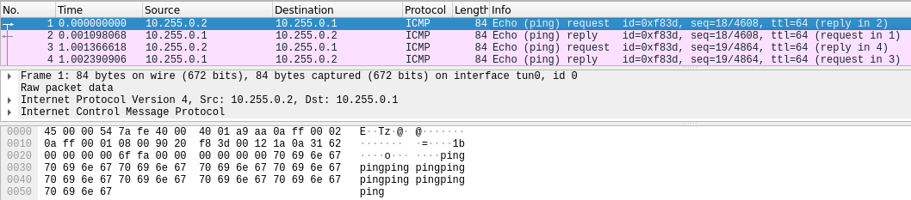

[TOC]

# Présentation

Openvpn est un logiciel open source qui permet de mettre en place un tunnel Privé Virtuel entre 2 machines, cet outil est très pratique pour permettre un accès au réseau depuis l’extérieur, par exemple pour effectuer du télétravail et avoir accès au réseau de l'entreprise à partir de chez soi.

### Prérequis

Dans un premier temps on installe openvpn et easy-rsa pour gérer les certificats.

```bash
sudo apt install openvpn easy-rsa -y
```

## Tunnel non  chiffré

Dans ce premier exemple je vais mettre en place un tunnel VPN très basique sans chiffrement, le but étant de tester l'outil et d'analyser les trames qui transite sur l'interface tun0 avec whireshark. (l'interface tun0 est la carte réseau utilisée par openVPN pour faire le tunnel.)


### Serveur

Sur le serveur il vous faudra initialiser le tunnel avec cette commande

```bash
sudo apt install openvpn easy-rsa -y && sudo openvpn --dev tun0 --verb 5 --ifconfig 10.255.0.1 10.255.0.2
```

ℹ️ C'est une commande qui est s'exécute en permanence, il ne faut pas la stoper au risque de couper le lien VPN !

### Client

Le client quant a lui a besoin de l'option `--remote` suivi de l'adresse IP du serveur a savoir dans notre exemple `192.168.1.25`.

```bash
sudo apt install openvpn easy-rsa -y && sudo openvpn --dev tun0 --verb 5 --ifconfig 10.255.0.2 10.255.0.1 --remote 192.168.1.25
```

Quand le message `Initialization Sequence Completed` apparait c'est bon la connexion entre les 2 machines est effectué, l'on peut alors vérifier celle si avec un ping du **client** vers le serveur.

```bash
ping -p70696E67 10.255.0.1
```

ℹ️ Ce ping est un peut spécial le `-p70696E67` est du texte au format hexadécimal qui va être ajouté au ping.

Dans le terminal de connexion ou la commande OpenVpn a était exécuté une suite de `RWr` apparait cela signifie que la connexion s'effectu bien dans les 2 sens.

```
RWrRWrRWrRWrRWrRWrRWrRWrRWrWRwrWRw
```

Pour voir plus en détail les trames qui sont envoyées avec la commande ping rien de mieux qu'une analyse wireshark.



Avec cette image extraite de wireshark l'on constate que :

1) La machine 10.255.0.1 effectue un `ping request` vers 10.255.0.2 
3) La machine 10.255.0.2 effectue un `ping reply` vers 10.255.0.1
ℹ️ il y a bien évidement d'autres informations a retirer comme le port, le protocole, etc...

## Tunnel avec chiffrement symétrique

Maintenant je vais crée un tunnel avec une clef pour chiffrer la connexion, ce type de chiffrement est loin d’être parfait, mais il permet de constater avec une analyse de tram si les trames du VPN sont bien chiffré.

⚠️ Veiller bien a arrêter la commande du tunnel non chiffré vu précédemment avec un CTRL+C

### Serveur

 Sur le serveur je génère la clef de chiffrement qui va être utilisé par les 2 machines et je donne accès en lecture à tous le monde sur le fichier clef pour pouvoir le transférer facilement via SCP. (un transfert avec FileZilla est également possible)

```bash
sudo openvpn --genkey secret /tmp/ClefSymetriqueSecrete && chmod o+r /tmp/ClefSymetriqueSecrete
```
⚠️ Avec le chiffrement symétrique toutes personnes qui peut lire la clef peut déchiffrer le tunnel VPN.

La commande pour initialiser le tunnel est sensiblement identique au tunnel non chiffré, mais avec l'option `--secret` pour indiquer qui faut utiliser la clef de chiffrement.

```bash
sudo openvpn --dev tun0 --verb 5 --ifconfig 10.255.0.1 10.255.0.2 --secret /tmp/ClefSymetriqueSecrete
```

### Client

Il faut d'abord récupérer la clef de chiffrement par exemple en SCP
```bash
cd /tmp && scp toor@192.168.1.25:/tmp/ClefSymetriqueSecrete .
```

Et enfin crée le tunnel côté client.

```bash
sudo openvpn --dev tun0 --verb 5 --ifconfig 10.255.0.2 10.255.0.1 --remote 192.168.1.25 --secret /tmp/ClefSymetriqueSecrete
```

## Tunnel avec chiffrement asymétrique

Le tunnel par chiffrement asymétrique est le plus complet, ce type de chiffrement est à utiliser. Pour le mettre en place, il va falloir généré plusieurs certificats de chiffrement les signée.


Pour mettre en place ce type de tunnel vpn, qui est les plus utiliser. Je vous invite a consulter les documentation ci-dessous.

https://openvpn.net/community-resources/reference-manual-for-openvpn-2-4/

http://csricted.univ-setif.dz/Documents/cours-informatique/Cryptographie-et-OpenVPN.pdf

https://openmaniak.com/fr/openvpn_tutorial.php
