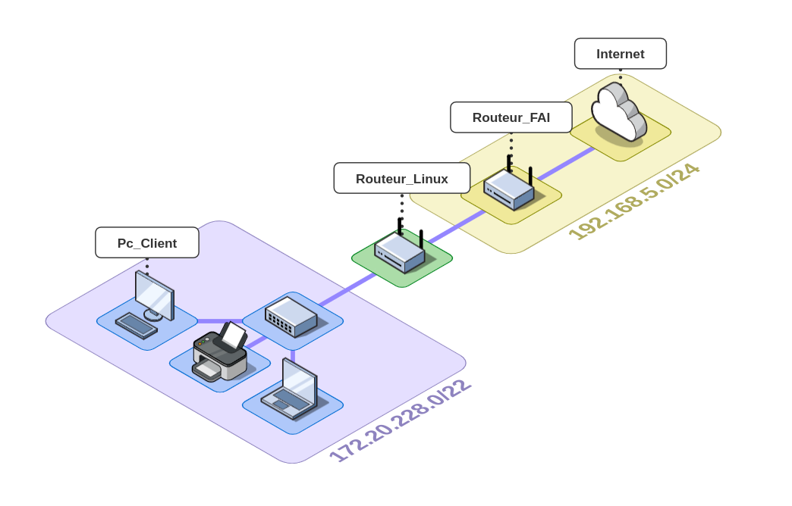
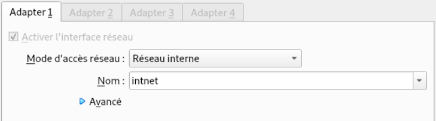
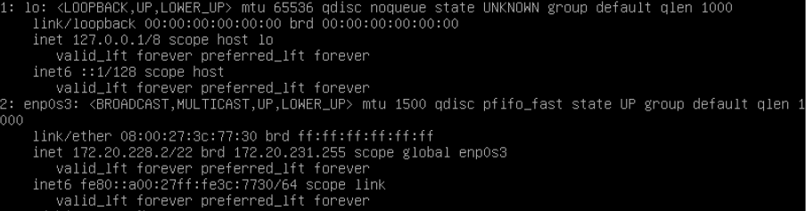
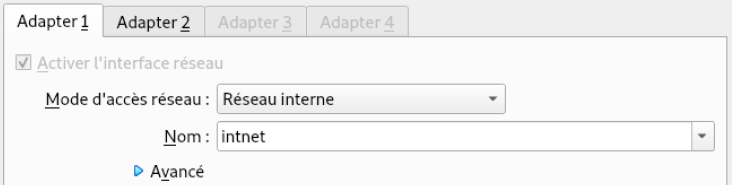
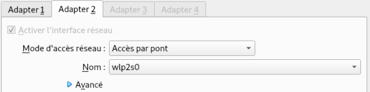

[TOC]

# Introduction

Nous allons transformer un système Debian en routeur afin d'interconnecter 2 réseaux.



# Préparation des machines virtuelles

Dans notre exemple nous allons préparer des machines avec Virtualbox

## Client

Dans un premier temps nous allons configurer l'interface réseau du client en réseau interne.



Ensuite l'on configure l'adresse ip du client en statique, via le fichier `/etc/network/interfaces`.

```bash
sudo nano /etc/network/interfaces
```

```
source /etc/network/interfaces.d/*

auto lo
iface lo inet loopback

auto enp0s3
iface enp0s3 inet static
        address 172.20.228.2
        netmask 255.255.252.0
        gateway 172.20.228.1
```

Redémarrage du pc
```bash
sudo reboot
```

Et enfin l'on vérifie que les modifications ont bien été prises en compte 

```bash
ip a
```



L'interface enp0s3 possède bien l'adresse ip 172.20.228.2, la nouvelle configuration à donc était appliquer.

## Routeur

Le routeur va avoir besoin de 2 cartes réseau, dans les paramètres réseau de la machine virtuel il va falloir activer 2 Adapter

Adapter 1 en Réseau interne



Adapter 2 en Accès par pont




## Configuration des interfaces réseau du routeur
### Identifier les interfaces
Nous allons commencer par configurer les 2 interface réseau en IP fixes. Dans un premier temp nous il va falloir lister les interface

```bash
ip a # Lister les interfaces réseau
```

```
1: lo:  mtu 65536 qdisc noqueue state UNKNOWN group default qlen 1000
      link/loopback 00:00:00:00:00:00 brd 00:00:00:00:00:00
      inet 127.0.0.1/8 scope host lo
         valid_lft forever preferred_lft forever
      inet6 ::1/128 scope host
         valid_lft forever preferred_lft forever
2: enp0s3:  mtu 1500 qdisc pfifo_fast state UP group default qlen 1000
      link/ether 08:00:27:c9:aa:a2 brd ff:ff:ff:ff:ff:ff
      inet 192.168.1.26/24 brd 192.168.1.255 scope global dynamic enp0s3
         valid_lft 84831sec preferred_lft 84831sec
      inet6 fe80::a00:27ff:fec9:aaa2/64 scope link
         valid_lft forever preferred_lft forever
3: enp0s8:  mtu 1500 qdisc noop state DOWN group default qlen 1000
      link/ether 08:00:27:02:eb:38 brd ff:ff:ff:ff:ff:ff
```

Le résultat de la commande ip a nous informe qu'il y a 3 interface réseau (lo, enp0s3, enp0s8)

lo = la boucle local du système

enp0s3 = Cette interface à récupérer un adresse ip 192.168.1.26 c'est dont l'interface en Accès par pont  (Adapter 1)

enp0s8 = Vu que l'on a identifié l'Adapter 1 enp0s8 est donc l' Adapter 2 configurer en Réseau interne

*Dans notre exemple l'identification des interfaces est simple car un serveur DHCP à fournie une adresse ip à l'interface en accès pas pont.*

### Définir une adresse ip statique pour les 2 interfaces

Pour pouvoir attribuer des adresse ip statique à nos 2 interface nous allons éditer les fichier `/etc/network/interfaces`.

```bash
sudo nano /etc/network/interfaces
```
Nous allons éditer le fichier pour qu'il ressemble à ça.
```bash
source /etc/network/interfaces.d/*

# Interface loopback
auto lo
iface lo inet loopback

# Interface Adapter 1
allow-hotplug enp0s3 enp0s8
iface enp0s3 inet static
        address 172.20.228.1
        netmask 255.255.252.0
        gateway 172.20.228.1

# Interface Adapter 2
allow-hotplug enp0s8
iface enp0s8 inet static
        address 192.168.1.26
        netmask 255.255.255.0
        gateway 192.168.1.1
```

On redémarre la machine

```bash
sudo reboot
```

Maintenant l'on va vérifié que la nouvelle configuration a bien était prise en compte, pour cela on va listant les interfaces.

```bash
ip a
```

```
1: lo: <LOOPBACK,UP,LOWER_UP> mtu 65536 qdisc noqueue state UNKNOWN group default qlen 1000
    link/loopback 00:00:00:00:00:00 brd 00:00:00:00:00:00
    inet 127.0.0.1/8 scope host lo
       valid_lft forever preferred_lft forever
    inet6 ::1/128 scope host
       valid_lft forever preferred_lft forever
2: enp0s3: <BROADCAST,MULTICAST,UP,LOWER_UP> mtu 1500 qdisc pfifo_fast state UP group default qlen 1000
    link/ether 08:00:27:c9:aa:a2 brd ff:ff:ff:ff:ff:ff
    inet 172.20.228.1/22 brd 172.20.231.255 scope global enp0s3
       valid_lft forever preferred_lft forever
    inet6 fe80::a00:27ff:fec9:aaa2/64 scope link
       valid_lft forever preferred_lft forever
3: enp0s8: <BROADCAST,MULTICAST,UP,LOWER_UP> mtu 1500 qdisc pfifo_fast state UP group default qlen 1000
    link/ether 08:00:27:02:eb:38 brd ff:ff:ff:ff:ff:ff
    inet 192.168.1.26/24 brd 192.168.1.255 scope global enp0s8
       valid_lft forever preferred_lft forever
    inet6 fe80::a00:27ff:fe02:eb38/64 scope link
       valid_lft forever preferred_lft forever
```

La nouvelle configuration à bien était appliquer, maintenant l'on vérifie la bonne communication de l'interface enp0s3 avec la passerelle. Pour cela on lance un ping depuis le router.

```bash
ping 192.168.1.1
```

```bash
PING 192.168.1.1 (192.168.1.1) 56(84) bytes of data.
64 bytes from 192.168.1.1: icmp_seq=1 ttl=64 time=1.01 ms
64 bytes from 192.168.1.1: icmp_seq=2 ttl=64 time=0.954 ms
64 bytes from 192.168.1.1: icmp_seq=3 ttl=64 time=1.06 ms
64 bytes from 192.168.1.1: icmp_seq=4 ttl=64 time=0.976 ms
64 bytes from 192.168.1.1: icmp_seq=5 ttl=64 time=0.975 ms
```

# Activation du mode routeur

editer le fichier /etc/sysctl.conf

```bash
sudo nano /etc/sysctl.conf
```

Décommenter la ligne net.ipv4.ip_forward ou ajouter la

>net.ipv4.ip_forward=1

Appliquer les changelent

```bash
sysctl -p
```

Vérification

```bash
sysctl net.ipv4.ip_forward
```

La valeur doit étre à 1