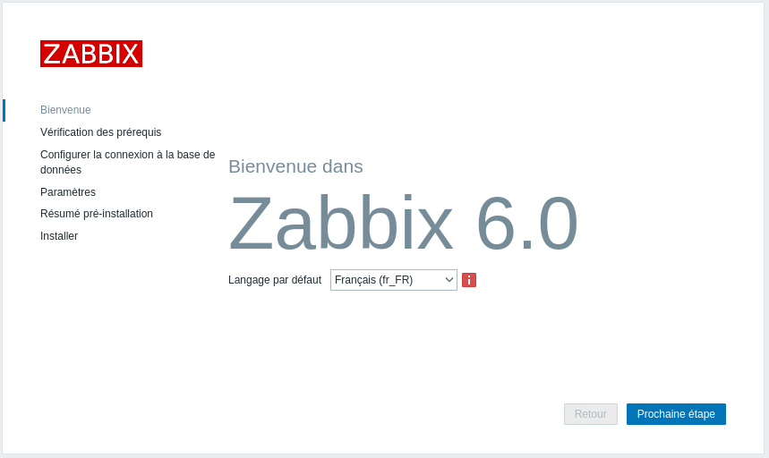
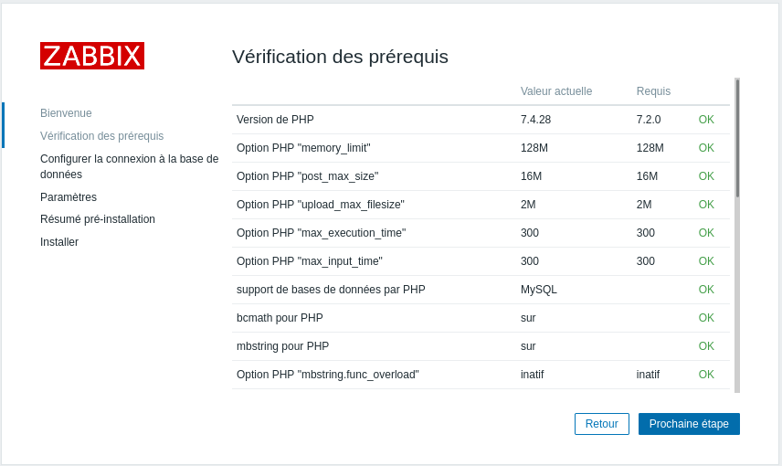
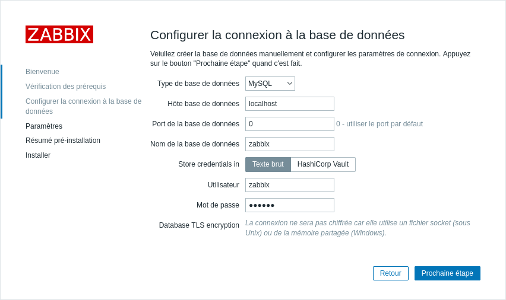
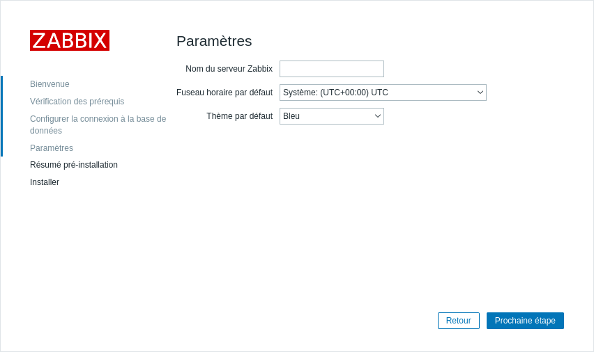
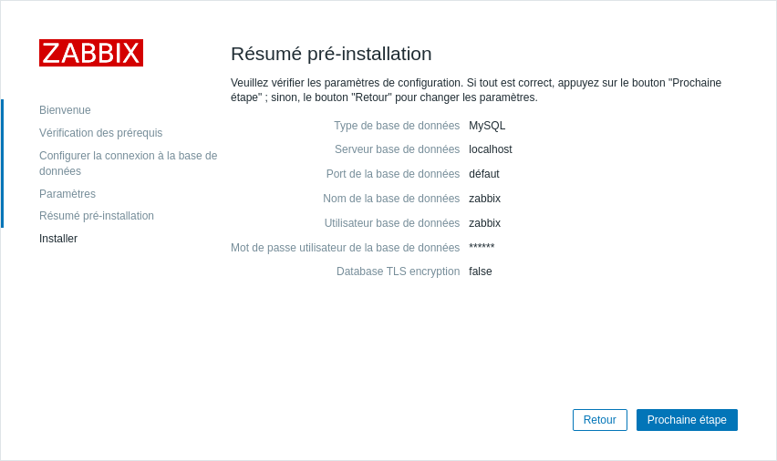
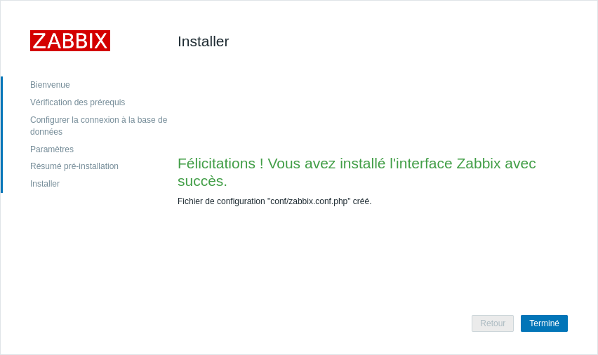
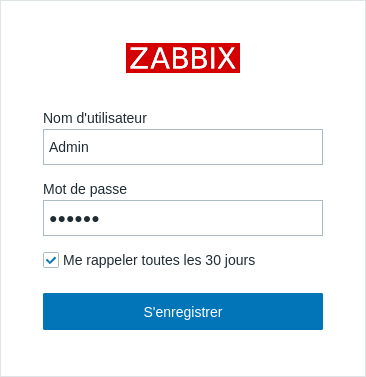
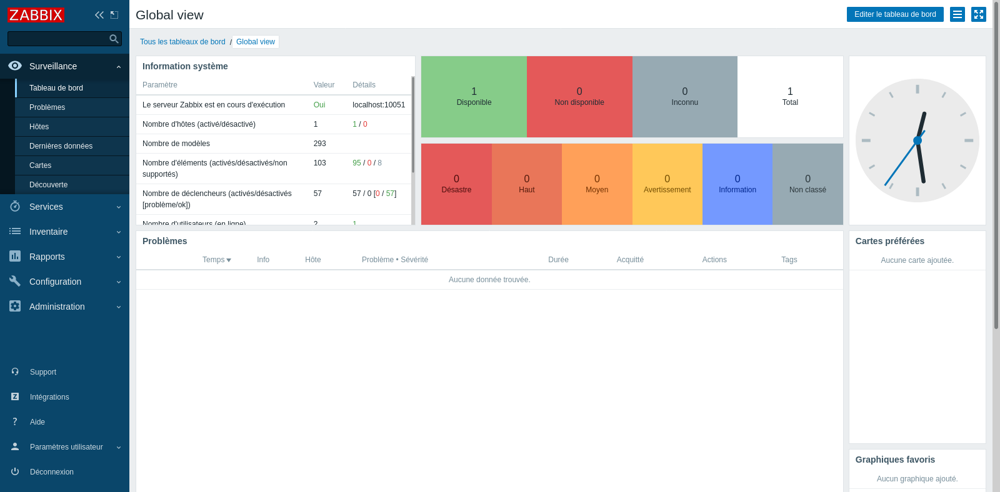

# Présentation

**ZABBIX** est un logiciel libre permettant de surveiller l'état de  divers services réseau, serveurs et autres matériels réseau et  produisant des graphiques dynamiques de consommation des ressources.

⏩ Par le temps ? Fait un copier-coller du texte ci-dessous et le serveur zabbix est installer 😄

```bash
cd /tmp/ && wget https://repo.zabbix.com/zabbix/6.0/debian/pool/main/z/zabbix-release/zabbix-release_6.0-1+debian11_all.deb
sudo dpkg -i zabbix-release_6.0-1+debian11_all.deb && sudo apt update -y
sudo apt install zabbix-server-mysql zabbix-frontend-php zabbix-apache-conf zabbix-sql-scripts zabbix-agent mariadb-server mariadb-client -y
sudo mysql -u "root" -Bse "CREATE DATABASE zabbix character set utf8mb4 collate utf8mb4_bin; CREATE USER zabbix@localhost IDENTIFIED BY 'zabbix'; GRANT ALL PRIVILEGES ON zabbix.* TO zabbix@localhost; FLUSH PRIVILEGES;"
sudo zcat /usr/share/doc/zabbix-sql-scripts/mysql/server.sql.gz | mysql -uzabbix -pzabbix zabbix
sudo sed -i 's/\^*# DBPassword=*/DBPassword=zabbix/g' /etc/zabbix/zabbix_server.conf | grep zabbix
sudo systemctl restart zabbix-server zabbix-agent apache2
sudo systemctl enable zabbix-server zabbix-agent apache2
```
---
## Installation

Téléchargement du fichier Debian Software Package
```bash
cd /tmp/ && wget https://repo.zabbix.com/zabbix/6.0/debian/pool/main/z/zabbix-release/zabbix-release_6.0-1+debian11_all.deb
```

Install le uniquement paquet Zabbix et mise ajour des dépôt.
```bash
sudo dpkg -i zabbix-release_6.0-1+debian11_all.deb && sudo apt update -y
```

Installation les paquets
```bash
sudo apt install zabbix-server-mysql zabbix-frontend-php zabbix-apache-conf zabbix-sql-scripts zabbix-agent mariadb-server mariadb-client -y
```

Création de l'utilisateur et de la base de données zabbix.
```bash
sudo mysql -u "root" -Bse "CREATE DATABASE zabbix character set utf8mb4 collate utf8mb4_bin; CREATE USER zabbix@localhost IDENTIFIED BY 'zabbix'; GRANT ALL PRIVILEGES ON zabbix.* TO zabbix@localhost; FLUSH PRIVILEGES;"
```

Initialisation de la base de données zabbix a partie du fichier server.sql.gz
⚠️ L'initialiation est longue il ne faut pas l'arréter.

```bash
sudo zcat /usr/share/doc/zabbix-sql-scripts/mysql/server.sql.gz | mysql -uzabbix -pzabbix zabbix
```

Ajoute le mot de passe mysql dans le fichier de configuration
```bash
sudo sed -i 's/\^*# DBPassword=*/DBPassword=zabbix/g' /etc/zabbix/zabbix_server.conf | grep zabbix
```
Redémarre et active les service zabbix
```bash
sudo systemctl restart zabbix-server zabbix-agent apache2 && sudo systemctl enable zabbix-server zabbix-agent apache2
```

## Connexion a la mire WEB

Pour finaliser l'installation il faut ce connexion en http sur le serveur avec un navigateur web dans mon cas l'url est  http://192.168.1.26/zabbix. Il ne reste cas suivre les étape d'installation.





A cette étape les identifiant de la base de donnée sont demande.
>Utilisateur : zabbix
>Mot de passe : zabbix









Pour la connexion  a la mire web les identifiant par default sont,
>Nom utilisateur : Admin
>Mot de passe : zabbix



Une fois arriver sur cette mire web, reste à ajouter les machine à supervisé via l'agent Zabbix ou par le protocol SNMP.



📝https://www.zabbix.com/download?zabbix=6.0&os_distribution=debian&os_version=11_bullseye&db=mysql&ws=apache