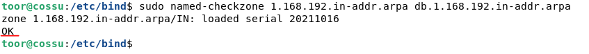
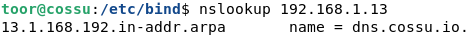

[TOC]
# Installation d'un dns linux (bind9)

## Préparation

- `sudo apt-get install dnsutils bind9`Installer les paquets bind9 et dnsutils

Editer les fichiers ci-dessous :

- `/etc/hostname` Indiquer le nom de la machine par le nom FQDN du serveur

- `/etc/host` Résolution locale d'affectation des noms d'hôtes a des adresses IP.

- `/etc/resolv.conf` indique quels serveurs de noms utiliser

  [linux-france.org]: http://www.linux-france.org/~mdecore/linux/doc/memo2/node179.html

```bash
# Fichier /etc/hostname
cossu.io
```

```bash
# Fichier /etc/host
127.0.0.1       localhost
127.0.1.1       cossu.io
192.168.1.13    cossu.io
```

```bash
# Fichier /etc/resolv.conf
# Generated by NetworkManager
search home cossu.io
nameserver 192.168.1.13
```

## Configuration

Editer les fichiers ci-dessous :

- `/etc/bind/named.conf.options` Les options de configuration du serveur DNS. 
- `/etc/bind/named.conf.local` On y déclare les zones associées au domaine.

[wiki.debian.org]: https://wiki.debian.org/fr/Bind9

```bash
# Fichier /etc/bind/named.conf.options
options {
        directory "/var/cache/bind";

        forwarders {
                8.8.8.8;	# Serveur dns google en forwarder
        };

		dnssec-validation auto;
        listen-on-v6 { any; };
};
```
```bash
# Fichier /etc/bind/named.cof.local
//
// Do any local configuration here
//
// Consider adding the 1918 zones here, if they are not used in your
// organization
//include "/etc/bind/zones.rfc1918";

zone "cossu.io" {
        type master;
        file "/etc/bind/db.cossu.io";
};

zone "1.168.192.in-addr.arpa" {
        type master;
        file "/etc/bind/db.1.168.192.in-addr.arpa";
};
```

### Création de la zones cossu.io

```bash
; Fichier /etc/bind/db.cossu.io
$TTL 604800
$ORIGIN cossu.io.
@       IN      SOA     dns.cossu.io. admin.cossu.io (
                        20211016    ; Numero de serie AnneMoisJour
                        604800      ; Temps de rafraichissement
                        86400       ; Temps entre les essais
                        2419200     ; Temps expiration
                        604800 )    ; Valeur TTL minimum
@       IN NS dns.cossu.io.

; On ajoute ensuite les enregistrements DNS
dns                     IN A 192.168.1.13
pc-linux                IN A 192.168.1.14
pc-win10                IN A 192.168.1.45
```
### Création de la zones 1.168.192 (zone inversé)

```bash
; Fichier /etc/bind/db.1.168.192.in-addr.arpa
$TTL    604800
@       IN      SOA     dns.cossu.io. admin.cossu.io (
                        20211016    ; Numero de serie AnneMoisJour
                        604800      ; Temps de rafraichissement
                        86400       ; Temps entre les essais
                        2419200     ; Temps expiration
                        604800 )    ; Valeur TTL minimum
;	On ajoute ensuite les enregistrements DNS
@       IN      NS     dns.cossu.io.
13      IN      PTR    dns.cossu.io.
14      IN      PTR    pc-linux.cossu.io.
45      IN      PTR    pc-win10.cossu.io.
```

## Vérification de la configuration

- Vérifie la syntaxe des fichiers des configurations
 ```bash
sudo named-checkconf
 ```

- Vérifier la syntaxe du fichier *db.cossu.io* pour la zone *cossu.io* 

 ```bash
sudo named-checkzone cossu.io db.cossu.io
 ```

  - Vérifie la syntaxe du fichier *db.1.168.192.in-addr.arpa* pour la zone *1.168.192.in-addr.arpa*

  ```bash
sudo named-checkzone 1.168.192.in-addr.arpa db.1.168.192.in-addr.arpa
  ```

  

## Teste de la résolution de nom

Pour tester que la résolution de nom fonctionne correctement l'on va utiliser la commande *nslookup* 

```bash
nslookup dns.cossu.io
```

  

- Vérification de la zone inverse :

```bash
nslookup 1.168.192.in-addr.arpa
```

  