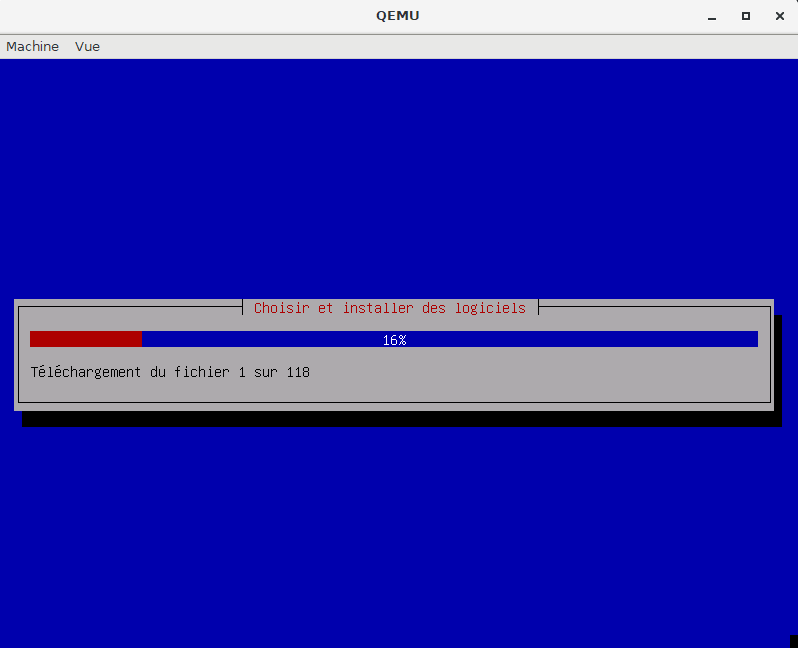

[TOC]

# QEMU c'es quoi ?

QEMU est une solution d'émulation de processeur et d'architecture qui est à la base de projet comme KVM et Virtualbox, c'est en quelque sorte une des briques fondamentales de ces outils de virtualisation.

⚠️ Pour suivre la suite il faut que QEMU soit installé sur votre système

## Crée une machine virtuel avec QEMU

Pour créer cette Machine Virtuelle (VM) il faudra définir les éléments suivants :

- Crée un disque Virtuel et ça tailles
- L'architecture du système de la VM
- Définir la RAM de la VM
- Indiquer les fichiers iso à utiliser

Dans un premier temps il me faut créé un disque virtuel qui va stocker toutes les données de la VM.

```bash
qemu-img create debian.img 8G
```

Au tour de l'architecture, celle que je vais utiliser est une architecture 64 bits *qemu-system-x86_64* mais il en existe d'autres *qemu-system-i386, qemu-system-arm,...* Il faut donc indiquer la bonne architecture. Par exemple amr64 pour des raspbian.

Et enfin la RAM, 1024Mo devrait suffire pour une debian sans interface graphique.

Voici donc la commande que j'exécuter pour créer la VM debian avec QEMU.

```bash
qemu-system-x86_64 -hda debian.img -cdrom debian-11.2.0-amd64-netinst.iso -m 1024M -boot order=dc
```

Une magnifique interface nommé QEMU apparaît 🥳



Une fois toutes les étapes d'installation effectuée, j'arrêter la machiner est la redémarrer avec la commande ci-dessous.

```bash
qemu-system-x86_64.exe -hda image.img --cdrom debian-11.2.0-amd64-netinst.iso -m 1024M
```

📝 https://doc.ubuntu-fr.org/qemu
📝 https://www.tremplin-numerique.org/comment-utiliser-qemu-pour-demarrer-un-autre-systeme-dexploitation
📝 https://www.lojiciels.com/quest-ce-que-qemu-kvm-sous-linux/#Quelles_sont_les_differences_entre_QEMU_et_KVM